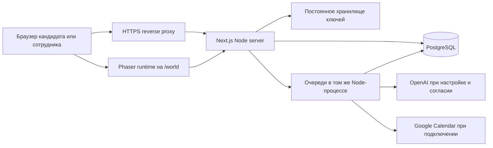

# Архитектура AI Leader ID

## Граница системы

Один Next.js 16 / React 19 сервер обслуживает публичный лендинг, заявку кандидата, личный кабинет, игровую зону и пространство комиссии. PostgreSQL через Prisma 6 хранит учётные записи, версии заявок, загруженные файлы, решения, очереди, прогресс дерева и World. Phaser 3 загружается отдельным клиентским модулем только на `/world`; он рисует игру, а сервер проверяет право и сохраняемые события. Статические игровые карты, спрайты и медиа лежат в `public/` и попадают в сборку. Исходники графики находятся в `assets/world/source/`.

## Слои и данные

| Область | Реализация | Постоянные данные |
| --- | --- | --- |
| Сессии, роли и доступ | `src/lib/security.ts`, `access.server.ts`, `passkeys.server.ts` | `User`, `Session`, разрешения, WebAuthn credentials |
| Заявка | `src/components/application-wizard.tsx`, `src/lib/intake.server.ts`, `application-draft.server.ts` | Черновик, отправленный snapshot, версии, согласия |
| Материалы | `src/app/api/files`, `src/lib/avatar.server.ts` | `Material.bytes` и аватары в PostgreSQL; выдача по владельцу/роли |
| Комиссия | `src/lib/review-service.server.ts`, `selection-actions.server.ts`, `src/app/admissions` | Оценки, источники, решения, интервью, история |
| AI и язык | `openai-gateway.server.ts`, `scoring-service.server.ts`, `audio-worker.server.ts`, `intake-worker.server.ts` | Задания очереди, версии, usage, стоимость, результаты |
| Развитие | `skill-tree.server.ts`, `development-tree.server.ts` | Попытки, completion, append-only `UPointEntry` |
| World | `src/world/runtime.ts`, `src/lib/world/*`, `src/app/api/world` | Версионированный `WorldSave`, важные события и U ledger |

Структура таблиц и ограничений находится в `prisma/schema.prisma`; изменения применяются только через `prisma/migrations/`. При отправке заявки фиксируется snapshot. Разрешённые фоновые задания создаются после фиксации, поэтому сбой внешнего AI не отменяет подачу. Сотрудник рассматривает источники и принимает решение самостоятельно. World, личные reflection и U не меняют AXIS, оценку поступления и очередь комиссии.

Файлы не записываются в локальный каталог контейнера: оригинальные байты сохраняются в PostgreSQL, а API выдаёт их после проверки доступа. OpenAI-ключ и OAuth-токены шифруются с локальным master key (`src/lib/local-secret.server.ts`). На Linux этот ключ находится в `~/.invision-u-secrets`; том должен быть постоянным и доступным только серверному пользователю. Потеря тома при сохранённой БД делает уже записанные внешние секреты нечитаемыми. Не копируйте его в Git или образ.

## Запуск и доверие

`src/instrumentation.ts` запускает обработчики очереди внутри долгоживущего Node-процесса. Это **не** архитектура для краткоживущих serverless-функций. Текущая поставка рассчитана на один постоянно работающий экземпляр приложения и PostgreSQL. При горизонтальном масштабировании потребуются отдельный worker, координация кэша/сессий и общий безопасный vault. Встроенная очередь использует состояние в БД, lease и ограниченные повторы, но таймеры должны продолжать работать после HTTP-запроса.

Входные данные браузера, игровые события, ответы модели и тексты источников считаются недоверенными. Route handlers и серверные операции повторно проверяют роль, владельца, версию и допустимость перехода. Исходные материалы кандидата и контекст Vision ограничиваются назначением и согласием. Код клиента не является основанием для начисления U или решения комиссии.

## Развёртывание

Рекомендуемый текущий контур: один Docker/Node-сервис, PostgreSQL, постоянный том master key, HTTPS reverse proxy. `Dockerfile`, `compose.yaml` и `compose.public.yaml` реализуют этот контур. Миграции выполняются перед стартом процесса командой `prisma migrate deploy`; seed с вымышленными учётными записями при публичном запуске **не** выполняется. `/api/health` проверяет доступность процесса и БД без раскрытия конфигурации. Пошаговый порядок, бэкапы и внешние настройки: [DEPLOYMENT.md](DEPLOYMENT.md).

Первый сотрудник создаётся только операторской командой `staff:bootstrap`, с паролем через stdin и запретом повтора после появления любой записи `STAFF`. Это не публичная регистрация сотрудника.
