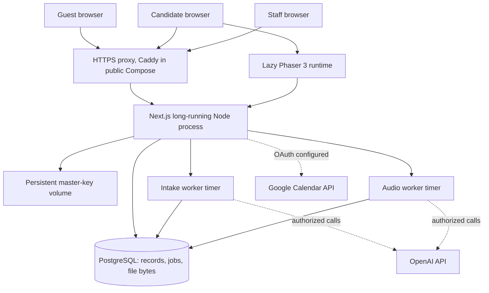

# AI Leader ID architecture

This document describes the current repository, not a proposed distributed system. [README.md](README.md) gives the product overview; [DEPLOYMENT.md](DEPLOYMENT.md) is the operator runbook. Concrete schemas and versions live in `prisma/schema.prisma`, `prisma/migrations/` and `package-lock.json`.

## System boundary and runtime topology

One Next.js 16 App Router application serves the public landing page, candidate application and cabinet, staff workspace, API routes and server-side domain operations. It runs as a **long-lived Node.js process** against PostgreSQL through Prisma 6. Phaser 3 is imported only for an authorized `/world` browser session. The included Docker Compose topology has one application container, one PostgreSQL container, persistent database and master-key volumes, and optionally Caddy for public HTTPS.



`src/instrumentation.ts` starts `startAudioWorker()` and `startIntakeWorker()` outside the production build phase. The intake loop polls Vision Desk, scoring, essay and calendar work. This is **PostgreSQL-backed persistent work processed inside the web process**, not an external queue service or an independently deployed worker. A short-lived serverless function does not match that execution model. The current deployment target is one application instance; the database remains durable when the process restarts.

The Docker image uses Node 22, installs dependencies, generates Prisma client and builds Next.js without production database credentials. At container startup it applies committed migrations with `prisma migrate deploy`, then runs `next start` as `node`. The `compose.public.yaml` overlay routes HTTPS through Caddy to the app; the app also exposes a loopback-only host port, and PostgreSQL has no public host port. `/api/health` executes `SELECT 1` and returns only process/database readiness.

## Application layers

| Layer | Primary code | Responsibility |
| --- | --- | --- |
| Browser routes | `src/app/`, `src/components/` | Landing, application, My Path, admissions screens and UI state. |
| Access | `src/lib/security.ts`, `access.server.ts`, `passkeys.server.ts` | Sessions, roles, candidate access spaces, WebAuthn and route/API checks. |
| Intake | `intake-contract.ts`, `intake.server.ts`, `application-draft.server.ts` | Rules, autosave, preflight, material references and submission versions. |
| Review | `review-service.server.ts`, `selection-actions.server.ts`, `scoring-service.server.ts` | Source review, human changes, stage decisions, interviews and publications. |
| AI | `openai-gateway.server.ts`, `vision-service.server.ts`, `vision-desk.server.ts`, `audio-worker.server.ts` | Permissioned requests, costs, validated outputs and durable work. |
| Development | `skill-tree.server.ts`, `development-tree.server.ts`, `src/lib/world/` | Private progress, validated rewards, World save and authored missions. |
| Game render | `src/world/runtime.ts` | Phaser scenes, player movement, camera, collision and input in the browser. |

React does not render each World tile or NPC as a DOM component. Next.js owns authentication, persistence and the HTTP boundary; Phaser owns the game loop and Canvas/WebGL scene.

## Principal data model

```text
User
  ├─ Session / Passkey / CandidateAccessGrant
  ├─ Application
  │    ├─ ApplicationVersion (draft and submitted snapshots)
  │    ├─ Material (binary original and metadata)
  │    ├─ Source / Episode / Correction
  │    ├─ ScoringRun / ScoringReview / Assessment
  │    ├─ Message / VerificationRequest
  │    ├─ Interview / InterviewVersion / CalendarOperation
  │    └─ Decision / FeedbackPublication
  ├─ LearningAttempt / LearningCompletion / UPointEntry
  └─ WorldSave / WorldEvent
```

Names reflect actual Prisma models; this is not the entire schema. `ApplicationVersion.snapshot` is stored as JSON with a revision and kind. A successful submission persists a `SUBMITTED` version and `submittedAt`; later clarification, material changes and human review are separate records or versions. The current intake rules version is frozen for the submitted application. Old snapshots are not silently rewritten to meet newer rules. Material bytes live in PostgreSQL, not a local upload directory or S3.

`LearningAttempt`, `LearningCompletion`, append-only `UPointEntry`, `WorldSave` and `WorldEvent` belong to candidate development. They are not automatically read as AXIS evidence or supplied to staff. A candidate may explicitly transfer a selected version of an existing work into the application; that is a bounded application material, not a transfer of all learning telemetry.

## Authentication and authorization

An opaque cookie session holds a random token; PostgreSQL stores its SHA-256 hash and expiry. Passwords are hashed with scrypt. The single `accessFor()` server function distinguishes `GUEST`, `APPLICATION`, `FULL`, `STAFF` and `RESTRICTED`. Full candidate access requires a valid submitted application snapshot or an unrevoked, applicable `CandidateAccessGrant`. Direct routes, server operations, file APIs, Vision context and World endpoints check ownership/role; hiding a tab alone does not confer protection.

Passkeys use SimpleWebAuthn. Server-stored, one-time challenges, expected origin, RP ID, user verification and credential ownership are checked during registration/login. Credential removal and session termination are separate operations. The browser's standard cross-device flow may display a system QR; no reusable account QR is stored. Physical phone-based login has not been accepted on an actual device in the latest QA.

Mutation routes also check request origin and rate limits where applicable. The browser is untrusted for admission actions, source access, World quest completion, rewards and purchased items. A `returnTo` parameter is restricted to internal routes and rechecked against the resolved access space.

## Application and evidence

The intake contract separates fields from versioned rules for entry type and program. Candidate fields include education, GPA with its original scale or a no-GPA state, applicable exams, motivation, essay, experience, language evidence and materials. Preflight distinguishes blocking formal requirements, nonblocking suggestions and pending verification. GPA scales are not silently normalized to a common score. The server repeats formal checks in the submission transaction.

`Material` stores original bytes, MIME, size, purpose, version and ownership. Upload checks size, declared type and file signature; files are served only to the owner or authorized staff for a submitted application. The download API supports byte ranges for media. Having a PDF or external video URL does not imply that its content was extracted, viewed or verified. Identity and family-support materials are excluded from the allowed AI evidence packet.

`Source` identifies the origin and version of a candidate statement or material; `Episode` groups accounts of a real event to avoid treating repeated descriptions as independent achievements. `Assessment` and `ScoringReview` preserve human interpretations separately from the original model or prepared result. New answers can open a review case rather than changing a previous final action in place.

## AXIS, human decisions and stability checks

The staff profile presents nine AXIS areas with grounds and source references. The scoring contract validates allowed areas, values, citations and source versions. The local provider gives a factual structured view to arbitrary applications; prepared numerical showcase results require exact fictional application origin/input and isolated-local scope. The runtime `ExternalAssessmentProvider` has **no generic scoring transport configured**. An optional OpenAI path in `scoring-service.server.ts` prepares *factual* summary/quotes/questions and does not infer nine domain values from prose.

Reviewers may inspect the original quote and material version, alter an interpretation with a reason and request a clarification. Stage actions and feedback publication recheck rights and current material/application versions. `Decision` and related records retain actor, prior state, rationale and reviewed snapshot. An approval of the current stage is not final enrollment. Feedback requires a separate preview/publication path, so an internal note is not automatically sent to the candidate.

Fairness Twin (`twin-cases.server.ts`, `twin-service.server.ts`) runs controlled pairs for wording, school/region exclusion, duplicate evidence, changes in personal role, language separation and rubric comparability. Its audit context is separate from official scoring and decision data. These controls test specified stability properties; they do **not** prove global fairness or accuracy on real applicants.

## AI execution and budgets

`OpenAIConnection` holds owner, selected task models, permission switches and monetary limits; `OpenAICall` records reservations and available provider usage/cost. The server gateway validates model/task combinations and enforces settings, budget, origin of the call and applicable consent. It does not choose an external provider merely because an API key exists. Model IDs are configurable; current schema defaults are `gpt-5.4-mini`, `gpt-6-sol`, `gpt-4o-mini-transcribe` and `gpt-4o-mini-tts`. Their availability in a given OpenAI project must be checked at connection time.

Vision receives only the candidate's allowed application/status/development context and validates source references in its answer. Vision Desk prepares a staff-facing summary and questions from permitted candidate sources. It can use deterministic local templates or the configured OpenAI Responses API. Neither assistant has an operation to approve/decline, award U or publish feedback without a staff action. Candidate content and game dialogue are treated as data, not instructions to the assistant. Standard automated tests use local/test transports and do not make paid calls.

The OpenAI owner flow is a current **deployment limitation**: `openai-settings.server.ts` accepts only a loopback `APP_ORIGIN`, and first-owner pairing displays a native macOS dialog. A fresh Linux public installation therefore cannot activate live OpenAI through its current UI. The core application and local factual handling still run. Public OpenAI setup requires a separately designed and verified secure operator path; placing a key in `.env.production` is not a supported substitute.

### Persistent jobs and recovery

`AudioJob` stores status, attempt count, next run, lease token/expiry and source/consent versions. The audio worker claims due jobs with PostgreSQL row locking, renews its lease and bounds retries. A completed transcript is retained if a later summary step fails; it is not paid for again solely because the summary needs a retry. Desk/scoring work uses stored `ScoringRun` records and input hashes. The intake worker polls application preparation-event watermarks to avoid processing every keystroke or mass-processing old submissions. Calendar work stores `CalendarOperation` with a stable request/event identity, allowing recovery after an ambiguous network response. Essay checks also use a versioned, hashed input and durable status.

| Failure or race | Current handling |
| --- | --- |
| AI unavailable during submission | Submitted snapshot remains; preparation records a pending/failure state and can be retried within its rules. |
| New source after analysis | Input/version mismatch makes the old interpretation stale; a new event/run can be prepared. |
| Stale reviewer action | Material/application revision checked again before application; previous history remains. |
| Process restart | Durable queued jobs and expired leases can be picked up by the same long-running worker topology. |
| Duplicate World event | Server validates ownership, proximity/quest state and event key; ledger reward is idempotent. |
| Two World tabs | Save revision conflict prevents a stale state from silently replacing a newer one. |

## Essay technical signal

`scripts/essay-detector.py` trains a Python TF-IDF/logistic classifier on the documented Russian Corus Essays source, with exact duplicate grouping, 70/15/15 grouped split, unigram/bigram selection, cross-validation and held-out metrics. `data/essay-detector/model.json` contains source URL, source license (MIT), file hashes, model coefficients and metrics. The bundled held-out split has 144 examples and F1 1.00; this is **source-domain benchmark performance, not validation on real admissions essays**. The baseline and selected model should not be called a calibrated probability of AI authorship.

`essay-check.server.ts` checks submitted essay language, text hash and minimum length before invoking the local Python artifact. Unsupported/mixed language and short text have separate states. A computed value is stored as `OUT_OF_DOMAIN` for admissions use. It does not change AXIS or create an automatic rejection. No applicant text is used to train the bundled model.

## Google Calendar and interviews

`google-calendar.server.ts` implements OAuth state/callback, owned-calendar selection, participant availability query and Calendar event operations. `selection-actions.server.ts` keeps interview preview, attendee list, IANA timezone, persistent operation and event identity. The adapter requests a separate Meet conference through `conferenceData.createRequest` with `conferenceDataVersion=1`; link creation may be pending, so a meeting is not represented as confirmed until Google returns it. Reschedule/cancellation operate on the linked event. A manual link remains a separate fallback.

Controlled adapter and recovery tests exist. A real OAuth login, live event/invitation and confirmed Meet URL require project credentials plus a dedicated authorized test calendar and were **not** part of the repository release verification. Vision Desk does not join calls or act as a meeting bot.

## Candidate development and World

The four Skill Tree domains are Leadership, Teamwork, Communication and English; Pitch is a Communication branch. Nodes and prerequisites live in the catalog, while attempts/completions and the append-only `UPointEntry` ledger are stored by owner. Completion is checked on the server and rewards are granted once per eligible action. These are learning progress markers, not admissions or psychological scores.

World uses authored map/quest/NPC/dialogue data in `src/lib/world/` and Phaser movement, collision, camera and scene lifecycle in `src/world/runtime.ts`. The browser obtains only the authorized save and sends bounded interaction events. `WorldSave` is a versioned aggregate with scene, safe position, quest flags, items, NPC state and revision; `WorldEvent` records meaningful events. The server validates scene, proximity, prerequisites, ownership and reward policy. Original source art in `assets/world/source/` is compiled to optimized `public/world/` assets. The game bundle is not part of initial landing/application rendering.

World choices, playtime, U, cosmetics and private reflections are not passed into the staff assessment or AXIS. The game is optional and does not carry required application information.

## Secret and file storage

`local-secret.server.ts` uses AES-256-GCM with a per-secret master key held in macOS Keychain when available or a permission-checked local file otherwise. In the Linux container, `HOME=/home/node`; `/home/node/.invision-u-secrets` is a persistent Compose volume. Encrypted provider values live in PostgreSQL. The master-key files and database are a **backup pair**: restoring one without the other loses access to stored external credentials. They are never copied into a Docker image, Git or client bundle.

Candidate binary originals are stored as PostgreSQL `Material.bytes` and served by authenticated routes. This simplifies current deployment but makes database growth and backup size operational concerns. There is no implemented object store.

## Deployment and scaling assumptions

The current supported topology is one long-running web/worker process, PostgreSQL, persistent secret volume and HTTPS. GitHub Actions checks application behavior and builds the image; it does not publish or deploy it. Public acceptance, real external credentials, backup restore and physical-device passkey/mobile testing remain operator tasks.

A future multi-instance design would need an independently supervised worker, shared secret management, distributed coordination, and potentially object storage. Those components are **not present** in this repository. Current installation and recovery commands are in [DEPLOYMENT.md](DEPLOYMENT.md).
