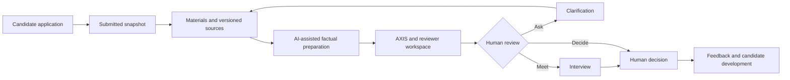
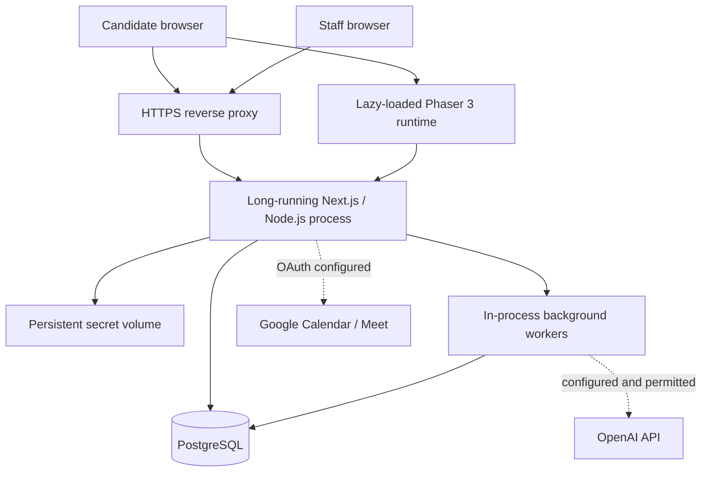

# AI Leader ID

[Работающая версия AI Leader ID](https://dogs.govtech-kz.com)

### Evidence-driven admissions for inVision U

AI Leader ID is an evidence-driven admissions operating system for inVision U. It connects structured applications, source-backed AI assistance, human review and a candidate development experience in one deployable full-stack platform.

**Every recommendation can be traced to application evidence. Every final admissions decision remains human.**

- Candidates submit education, results, essays, experience and materials in a versioned application.
- Staff review evidence and AXIS criteria, request clarification, arrange interviews and record decisions.
- Vision and Vision Desk use bounded, permission-aware context; external AI requires configuration and consent.
- After submission, candidates can use Skill Tree, earn U Points and explore a real Phaser-based inVision World.

## Why AI Leader ID

An admissions decision needs more than a number or an isolated essay. Reviewers need to see what the applicant actually submitted, which material supports an interpretation, what remains unverified and how a decision changed. Candidates need a clear application path and a useful space after submission. AI Leader ID keeps those workflows together while separating **admissions evidence** from **private learning activity**.

## What we built

| Layer | Working implementation |
| --- | --- |
| Admissions core | Multi-section application with autosave, version conflict handling, configurable intake rules, education and original-scale GPA, exams, essays, files, English flow, preflight and submitted snapshots. |
| Reviewer workspace | Candidate queue, source and material review, nine AXIS areas, clarification, human assessment, interview preparation, stage actions, decision history and separate feedback publication. |
| Intelligence | PostgreSQL-backed preparation jobs; a local factual provider or configured OpenAI source-backed summaries, questions and audio processing; Vision for the candidate and Vision Desk for staff. |
| Stability and ML | Controlled Fairness Twin comparisons and a separate Russian essay-text technical signal. Neither proves fairness or authorship, nor automatically rejects an applicant. |
| Development | Four-domain Skill Tree, server-validated completion, append-only U Point ledger and a saved Phaser 3 World with districts, NPCs, dialogue, missions and optional cosmetics. |

This is a server-side product: authentication, authorization, snapshots, private binary files, background jobs, human actions, game rewards and persistent progress are implemented beyond the screens. Prepared scores belong only to specific fictional showcase records; arbitrary applicants do not receive them.

## How it works



Submission persists before background preparation. A failed external request does not erase an application or turn into a negative decision. A clarification adds new evidence instead of silently rewriting the submitted snapshot.

## Product experience

### Candidate

A guest sees the inVision U admissions landing page. A registered applicant continues a saved draft, checks preflight feedback and submits it. A valid submitted snapshot immediately opens **My Path / Мой путь**; AI processing does not block access. The submitted application, messages, interviews and published result remain accessible there. **Skill Tree / Дерево навыков** and **inVision World** are voluntary development areas.

### Admissions team

Staff use the existing **Candidates / Кандидаты**, **Interviews / Интервью** and **Decisions / Решения** space. The candidate profile shows a preliminary summary, source-linked AXIS grounds, English separately and compact stage actions. Staff can adjust interpretations with reasons, request clarification, schedule an interview or record an approval/decline. A stage approval is not an automatic enrollment offer; feedback is previewed and published separately. Decision authorship, material versions and prior states remain in the database.

## System architecture



Next.js serves the landing page, candidate and staff routes, APIs and authorization. Prisma accesses PostgreSQL. `src/instrumentation.ts` starts audio and intake workers **inside the application process**; the latter also polls Desk, scoring, essay and calendar work. The current topology is one long-running Node instance plus PostgreSQL, not a short-lived stateless serverless deployment. The included Compose overlay uses Caddy for HTTPS; another reverse proxy can be used with the exact configured origin and secure cookies. See [ARCHITECTURE.md](ARCHITECTURE.md) for the data and failure model.

The principal persisted objects are `User`, `Session`, `Passkey`, `Application` and `ApplicationVersion`, `Material`, `Source`, `Episode`, `Assessment`, `ScoringRun`, `Interview`, `Decision`, `LearningAttempt`, `LearningCompletion`, `UPointEntry` and `WorldSave`. Candidate-owned development data is not automatically copied into admissions scoring or the staff profile.

## AI, ML and explainability

| Component | Actual role | Boundary |
| --- | --- | --- |
| Evidence preparation and Vision Desk | Local templates or configured OpenAI Responses API prepare factual summaries, source-linked grounds and suggested questions. | Requires applicable consent and budget for external calls; staff verify facts and take actions. |
| Vision | Candidate assistant uses permitted application rules, own status and private learning context; configured OpenAI generates validated answers. | Cannot submit an application, unlock nodes, grant U or change admissions outcomes. |
| Audio | A separate configured transcription model processes consented audio; transcripts and summaries have job and source versions. | No voice-based personality judgement; a failed summary does not require repeating a completed transcription. |
| AXIS | Nine-area, versioned evidence and review display with human adjustments. | A review aid, not a psychological diagnosis or autonomous decision. Numerical prepared values are scoped to fictional showcase histories. |
| Fairness Twin | Controlled counterfactual pairs test stability when wording, school/region fields, duplicate evidence, roles or rubric conditions change. | These checks do not establish the absence of bias in real admissions. |
| Essay signal | Bundled Python TF-IDF/logistic classifier with grouped, deduplicated splits. | Technical text signal only; never automatic rejection, AXIS change or proof of authorship. |

The essay artifact records **671 training, 144 validation and 144 held-out examples**. On its bundled **Russian Corus Essays source benchmark**, held-out F1 is **1.00** (precision 1.00, recall 1.00, false-positive rate 0 on 144 examples). **This is not validation on real inVision U admissions essays and does not mean 100% AI-text detection accuracy.** The source and its MIT dataset license are recorded in [`data/essay-detector/model.json`](data/essay-detector/model.json); this is not a license for the whole repository. The current check is Russian-only: unsupported language and short text have explicit states; an in-domain model output is stored as `OUT_OF_DOMAIN` for admissions use. Model training uses no applicant essay data.

Model IDs and monetary limits are server-side settings. Current schema defaults include `gpt-5.4-mini` for text, `gpt-6-sol` for complex work, `gpt-4o-mini-transcribe` and `gpt-4o-mini-tts`; availability depends on the connected OpenAI project. **AI prepares. Humans decide.** A reviewer can open the criterion, interpretation, source, quote and version, then retain a separate human correction. Later material does not silently replace an earlier decision.

## inVision World

`/world` dynamically loads a **Phaser 3** Canvas/WebGL runtime after full candidate access is confirmed. It has movement, collisions, camera, NPC dialogue, interactive objects, missions and persistent save state across Campus Square, five program-themed districts, interiors and a café. Festival of Ideas includes an introductory quest, role stories and optional side stories. Completion and U Point rewards are checked server-side with revision and idempotency rules. The World also has an optional personal space, cosmetics and collected postcards.

World is for exploration and development. Movement, choices, playtime, U balance and role preferences do **not** change AXIS, admissions recommendations or commission decisions. A candidate can separately choose a specific work version to submit as an application material; the rest of the development history stays private.

## Technology stack

| Concern | Current repository |
| --- | --- |
| Web | Next.js 16.3.5 App Router, React 19.3, TypeScript 5.9, Tailwind CSS 4 and project CSS tokens |
| Data | PostgreSQL; Prisma 6.19 schema and additive migrations |
| Auth | Database sessions, scrypt password hashes, SimpleWebAuthn 14 passkeys and server-side access spaces |
| Game | Phaser 3.90, original pixel assets and versioned PostgreSQL saves |
| AI / ML | Configurable OpenAI API gateway; Python TF-IDF/logistic essay artifact; Zod 4 validation |
| Media | FFmpeg and Sharp; uploaded original bytes in PostgreSQL |
| Delivery | Node 22 Docker image, Docker Compose, optional Caddy HTTPS overlay, GitHub Actions |

## Security and data boundaries

The browser does not authorize itself to view a file, decide admission, complete a quest or award U. The server checks roles, ownership, origin, versions and idempotency for relevant operations. Sessions store token hashes; passkey challenges and origins are verified server-side. Candidate files are served through authenticated endpoints, with byte-range support for media.

OpenAI and Google credentials remain server-side. The local secret store encrypts provider credentials; on Linux its master-key files live in a persistent `~/.invision-u-secrets` volume. **A PostgreSQL backup without the matching secret volume cannot restore those external credentials.** Neither keys nor application uploads are committed to this repository. See [ARCHITECTURE.md](ARCHITECTURE.md) for the precise trust boundaries.

## Repository structure

```text
src/app/              Next.js pages and API routes
src/components/       Candidate, staff and World UI
src/lib/              Auth, intake, review, AI, queues and domain services
src/world/            Phaser runtime
prisma/               Schema, additive migrations and guarded local seed
scripts/              Local setup, verification, asset build and operator scripts
data/essay-detector/  Bundled model artifact and provenance
assets/world/source/  Original source art
public/world/          Optimized browser game assets
tests/                 Unit, contract and integration tests
```

## Quick start: local development

Use **Node.js 22**, npm, PostgreSQL command-line tools (`initdb`, `pg_ctl`, `psql`, `createdb`) and `rg` in `PATH`. `setup` creates a local trust-auth PostgreSQL cluster at `127.0.0.1:55439` and fictional data; it is for an isolated development machine, not a public server. On a fresh clone:

```sh
git clone https://github.com/BAITC-Hacks/hack-051a0227-dogs.git
cd hack-051a0227-dogs
npm ci
npm run setup
npm run dev
```

Open [http://localhost:3000](http://localhost:3000). The seed creates fictional local-only accounts, including `admissions@invision.local` / `LeaderDesk2026!` and `aigerim@candidate.local` / `MyPath2026!`. Do not reuse these credentials or run the seed in a public environment. The script requires `ENABLE_LOCAL_SEED=true` **and** a loopback database host; the production Compose database is not a loopback host.

For an **existing or external PostgreSQL**, do not run `setup`: copy `.env.example` to an ignored `.env`, set `DATABASE_URL` and `APP_ORIGIN`, then run `npm ci`, `npm run db:migrate` and `npm run dev`. Leave `ENABLE_LOCAL_SEED=false`; apply the seed only to a deliberately isolated loopback database. `APP_ORIGIN` must match the browser origin, especially for passkeys. Stop the local cluster with `npm run db:stop` only if it is the cluster started by this repository.

## Production-like self-hosting

The repository ships a Docker image and two Compose files. A Linux VPS or equivalent long-running host needs Docker Compose, a domain pointed at it, inbound ports 80/443, disk space and a backup destination. From a secure server checkout:

```sh
cp .env.production.example .env.production
# Edit domain, database password and origin; keep this file out of Git.
chmod 600 .env.production
docker compose --env-file .env.production -f compose.yaml -f compose.public.yaml up -d --build
docker compose --env-file .env.production -f compose.yaml -f compose.public.yaml ps
curl -fsS https://YOUR_DOMAIN/api/health
```

Replace `YOUR_DOMAIN` with the configured domain. The image runs committed Prisma migrations before starting the long-lived Next.js server as a non-root user. Caddy handles TLS; PostgreSQL stays on the Compose network, while the app also binds only to server loopback for diagnostics. `/api/health` checks **only the web process and database query**, not external integrations or a complete user journey. The first staff account is created with a one-time stdin-only operator command documented in [DEPLOYMENT.md](DEPLOYMENT.md). No fictional seed runs on public startup. The team VPS at `https://dogs.govtech-kz.com` was reachable over HTTPS on 29 September 2026; live OpenAI, Google Meet and physical passkey flows remain separately unverified.

| Setting | Meaning |
| --- | --- |
| `DATABASE_URL` | Prisma connection string; in Compose its password matches `POSTGRES_PASSWORD`. |
| `APP_ORIGIN` | Exact external origin used for security checks and WebAuthn. |
| `APP_DOMAIN` | Hostname for the included Caddy overlay. |
| `COOKIE_SECURE` | `true` behind HTTPS. |
| `ENABLE_LOCAL_SEED` | Leave `false` outside isolated local development. |
| `ASSESSMENT_ENVIRONMENT` | `standard` for real applications; `isolated-local` only for controlled fictional fixtures. |
| `GOOGLE_CLIENT_ID`, `GOOGLE_CLIENT_SECRET` | Optional server-side Calendar OAuth Web client; callback `${APP_ORIGIN}/api/google/callback`. |

OpenAI keys are **not** provisioned through an environment variable. On a fresh public Linux installation, the operator can bind the first verified staff account as connection owner with `--openai-owner` during bootstrap. The owner then saves the key in `/settings/openai` and enables Vision within a budget; the local macOS pairing flow remains limited to loopback installations. A saved key does not prove a successful paid OpenAI request, which still needs a controlled live check. Google Calendar/Meet has an OAuth adapter and controlled tests, but real OAuth, event creation and a confirmed Meet link require external credentials and an authorized test calendar. See [DEPLOYMENT.md](DEPLOYMENT.md) for operational steps and limitations.

## Testing and verification

```sh
npm run typecheck
npm run lint
npm run quality:check
npm run build
npm test
```

`npm test` includes integration scenarios and needs a running PostgreSQL database plus the matching built application origin; use a disposable test database, not a real admissions database. `quality:check` is an isolated local-provider check and performs no paid OpenAI calls. GitHub Actions runs `npm ci`, migrations, guarded fictional seed, typecheck, lint, quality checks, a production Webpack build, integration tests against the running server and a separate Docker image build. It does **not** deploy. See [QA.md](QA.md) for dated verification and untested external scenarios. A full browser walkthrough on a real public host and physical-device passkey/mobile checks remain separate acceptance work.

## Documentation

- [ARCHITECTURE.md](ARCHITECTURE.md): runtime, data model, trust, AI and failure boundaries.
- [DEPLOYMENT.md](DEPLOYMENT.md): VPS setup, first staff, backups, upgrade and recovery.
- [PRODUCT.md](PRODUCT.md): product behavior and boundaries.
- [DESIGN.md](DESIGN.md): visual and interaction system.
- [REQUIREMENTS.md](REQUIREMENTS.md): requirements and constraints.
- [QA.md](QA.md): actual verification, known failures and limits.
- [CHANGELOG.md](CHANGELOG.md): dated development history from the former README.

No repository-wide license is declared here. The essay benchmark has its own provenance and license in the model artifact; the World art is original to this project.
